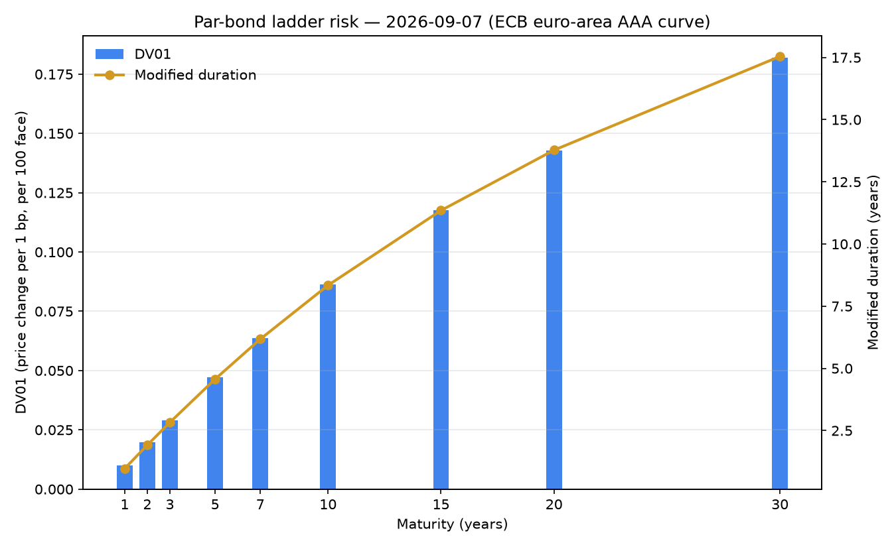
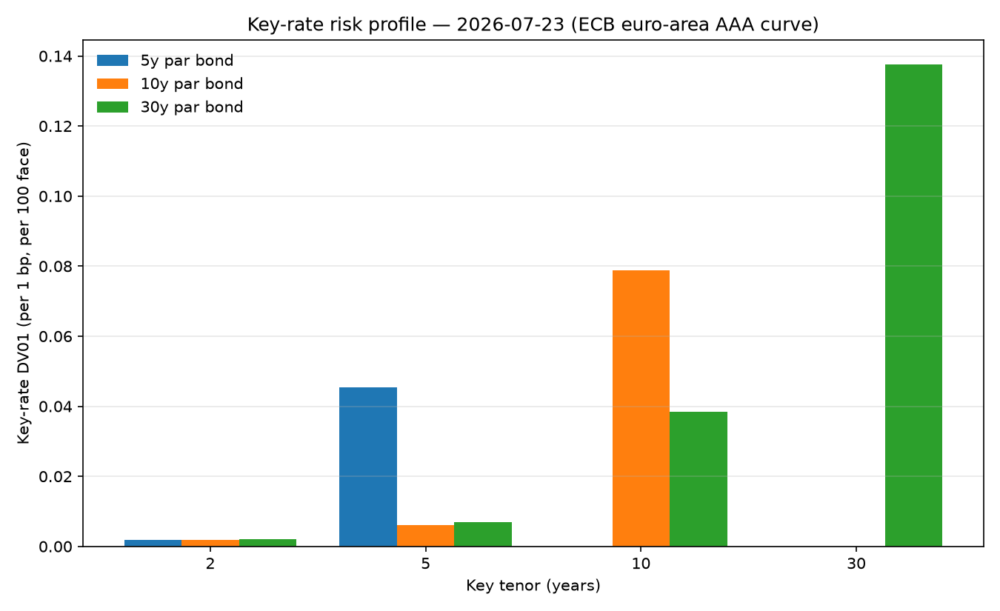

# eur-curves

**A living EUR yield-curve lab.** Every business day the ECB publishes the six Svensson
parameters of the euro-area AAA government bond curve. This repo fetches them, rebuilds the
full spot / forward / discount curve from the raw parameters, **proves the rebuild against the
ECB's own published spot rates** (must agree to 0.5 bp — in practice it agrees to ~1e-8 bp),
and commits a fresh snapshot + charts on a daily GitHub Actions cron.

Sibling of [svi-lab](https://github.com/0scarito/svi-lab) (volatility surfaces); this one is
the rates leg.

## The curve right now


Charts and [`data/latest.json`](data/latest.json) are refreshed by the
[`refresh` workflow](.github/workflows/refresh.yml) each weekday at 13:30 UTC.

## Validated against the source

The point of the exercise: if you evaluate the Svensson formula correctly, the ECB's published
zero-coupon spot rates fall out of the six parameters exactly. `scripts/refresh.py` checks this
on every run and refuses to write a snapshot if any tenor is off by more than 0.5 bp.

Actual output from the 2026-07-10 curve (run 2026-07-13):

```
 series  tenor  ECB published  our spot_rate   err (bp)
  SR_3M   0.25       2.315957       2.315957  -0.000000
  SR_6M   0.50       2.406181       2.406181  -0.000000
  SR_1Y   1.00       2.515208       2.515208  -0.000000
  SR_2Y   2.00       2.599299       2.599299   0.000000
  SR_5Y   5.00       2.743048       2.743048  -0.000000
  SR_7Y   7.00       2.887694       2.887694  -0.000000
 SR_10Y  10.00       3.108554       3.108554  -0.000000
 SR_15Y  15.00       3.388371       3.388371   0.000000
 SR_20Y  20.00       3.545609       3.545609  -0.000000
 SR_30Y  30.00       3.604663       3.604663  -0.000000

max |error|: 0.000000 bp (tolerance 0.5 bp)
```

Max absolute error on that run: **9.2e-9 bp** across all ten published tenors — pure
rounding noise, since the ECB publishes values to 10 decimal places.

## What it does

- **`eur_curves.svensson`** — the Svensson (1994) model: zero-coupon spot rate, continuous-compounding
  discount factor, and instantaneous forward rate, with analytic `t -> 0` limits.
  Scalar or NumPy-array maturities.
- **`eur_curves.ecb`** — client for the [ECB Data Portal](https://data.ecb.europa.eu/)
  (dataset `YC`, no API key needed): daily parameters, published spot rates, and their histories,
  parsed into a `CurveParams` dataclass / pandas frames.
- **`eur_curves.bonds`** — fixed-income analytics off a `CurveParams`: bullet-bond pricing,
  effective-annual yield to maturity, DV01 (an exact parallel curve shift), Macaulay / modified
  duration, and convexity.
- **`eur_curves.plots`** — the charts above (curve, history, and par-bond-ladder risk).
- **`scripts/refresh.py`** — fetch, validate, snapshot (`data/latest.json`), chart. Run by cron.

## Fixed-income analytics

`eur_curves.bonds` prices bullet fixed-coupon bonds directly off a day's Svensson curve and
derives the usual risk measures. Pricing discounts each cashflow with the curve's
continuous-compounding discount factor. Yield to maturity is an **effective annual** rate
solving `sum(cf * (1 + y) ** -t) == price`, the convention that makes a par bond's YTM equal its
coupon and `modified = macaulay / (1 + y)` exact. DV01 is an **exact parallel shift** of the
curve: `beta0` enters `y(t)` additively, so bumping it by ±1 bp lifts every spot rate by exactly
1 bp with no re-fitting.



```python
import eur_curves as ec

params = ec.fetch_params()                            # latest ECB Svensson curve
coupon = ec.par_coupon(params, 10.0)                  # coupon that prices a 10Y to par
bond   = ec.Bond(face=100.0, annual_coupon_rate=coupon, maturity_years=10.0)

ec.price(bond, params)                                # 100.0 (struck at par)
ec.yield_to_maturity(bond, ec.price(bond, params))    # == coupon for a par bond
ec.dv01(bond, params)                                 # price change per 1 bp parallel shift
ec.modified_duration(bond, params)                    # macaulay / (1 + y)
ec.convexity(bond, params)
```

Worked example on the committed 2026-07-10 curve (`face = 100`, annual coupons) — the par
ladder plotted above:

```
 mat  coupon %      DV01   mod dur  convexity
   1    2.5471   0.01000   0.97516     1.0000
   2    2.6323   0.01974   1.92369     3.9230
   3    2.6715   0.02923   2.84649     8.6648
   5    2.7750   0.04737   4.60863    23.1628
   7    2.9142   0.06430   6.24743    43.5203
  10    3.1203   0.08728   8.46421    82.8018
  15    3.3694   0.11956  11.56590   164.2009
  20    3.5040   0.14568  14.07433   257.0636
  30    3.5704   0.18600  17.95920   458.7455
```

The 10Y par bond: coupon **3.1203%**, DV01 **0.0873** per 100 face, Macaulay duration
**8.728y**, modified duration **8.464y** (= 8.728 / 1.031203), convexity **82.80**. A par bond's
effective-annual YTM comes back exactly equal to its coupon, and the 1Y point is a single
cashflow so its convexity is exactly `1.0`.

## Key-rate durations

Since v0.3.0 the lab decomposes rate risk by **maturity bucket**, not just the single
parallel-shift number. DV01 tells you what happens if the whole curve moves 1bp; it can't tell a
10-year bullet apart from a 2s/30s barbell with the same DV01 but opposite reaction to a
steepening. Key-rate durations (Ho 1992) fix that: perturb the spot curve with a **triangular
bump** centred on each key tenor (2y/5y/10y/30y by default), ramping linearly to zero at the
neighbours, and reprice.

The bumps are a *partition of unity* — the tents sum to 1 at every maturity — so bumping every key
at once is exactly a parallel shift, and therefore

```
sum of the key-rate DV01s  ==  the parallel DV01
```

to numerical precision. That reconciliation is the module's headline test (`parallel_dv01_from_keys`),
and it's what makes the decomposition trustworthy rather than ad-hoc.



```python
from eur_curves import Bond, fetch_params, key_rate_dv01, parallel_dv01_from_keys

params = fetch_params("latest")
bond = Bond(face=100.0, annual_coupon_rate=0.03, maturity_years=10.0)
print(key_rate_dv01(bond, params))        # {2.0: ..., 5.0: ..., 10.0: <largest>, 30.0: ...}
print(parallel_dv01_from_keys(bond, params))   # (sum of KR01s, parallel DV01) — they agree
```

The chart above (real ECB curve) shows each par bond loading its own bucket: the 5y bond sits in
the 5y key, the 10y in the 10y, the 30y in the 30y — with small spillover to neighbours from the
coupon stream.

## Install

```bash
git clone https://github.com/0scarito/eur-curves
cd eur-curves
pip install -e ".[dev]"
```

Requires Python >= 3.10. Runtime deps: numpy, pandas, requests, matplotlib.

## Usage

```python
import eur_curves as ec

params = ec.fetch_params()            # latest ECB Svensson parameters
print(params.date, params.beta0)      # e.g. 2026-07-10 1.3035816676

y10 = ec.spot_rate(10.0, *params.as_tuple())     # 10Y zero rate, % cont. comp.
f10 = ec.forward_rate(10.0, *params.as_tuple())  # instantaneous forward at 10Y
p10 = ec.discount_factor(10.0, *params.as_tuple())

date, spots = ec.fetch_published_spots()         # the ECB's own numbers
assert abs(y10 - spots["SR_10Y"]) * 100 < 0.5    # basis points

hist = ec.fetch_spot_history(["SR_2Y", "SR_10Y"], start="2024-07-01")
```

Refresh the snapshot and charts locally:

```bash
python scripts/refresh.py
```

Tests are network-free by default (fixtures are verbatim captured ECB responses);
the live end-to-end check is opt-in:

```bash
pytest -q                        # 49 passed, 1 skipped
RUN_NETWORK_TESTS=1 pytest -m network
```

## How it works

The ECB fits a Svensson (extended Nelson-Siegel) curve to AAA-rated euro-area central
government bonds each TARGET business day and publishes the parameters
(beta0, beta1, beta2, beta3, tau1, tau2). The zero-coupon spot rate at maturity `t` years,
in percent with continuous compounding, is

```
y(t) = b0 + b1 * (1 - exp(-t/tau1)) / (t/tau1)
          + b2 * [(1 - exp(-t/tau1)) / (t/tau1) - exp(-t/tau1)]
          + b3 * [(1 - exp(-t/tau2)) / (t/tau2) - exp(-t/tau2)]
```

with `y(0) = b0 + b1`. The instantaneous forward rate is the derivative of `t * y(t)`:

```
f(t) = b0 + b1*exp(-t/tau1) + b2*(t/tau1)*exp(-t/tau1) + b3*(t/tau2)*exp(-t/tau2)
```

and the discount factor is `P(t) = exp(-y(t)/100 * t)`. `b0` is the long-run rate level,
`b0 + b1` the short-end anchor, and the `b2`/`b3` terms add two humps located
around `tau1` and `tau2`.

Data comes from the ECB Data Portal REST API,
`https://data-api.ecb.europa.eu/service/data/YC/B.U2.EUR.4F.G_N_A.SV_C_YM.<SERIES>?format=csvdata`,
where `<SERIES>` is `BETA0..TAU2` for parameters or `SR_3M..SR_30Y` for published spots.

Unit tests pin the implementation to reference values computed independently with 50-digit
`decimal` arithmetic (agreement checked at `rel=1e-13`), verify `f(t)` against a numerical
derivative of `t*y(t)`, and round-trip the discount factor.

## Limitations (read before using)

- **This is the AAA euro-area government curve, not a discounting curve.** Post-2008 practice
  discounts collateralised trades off OIS (€STR) curves; the ECB AAA curve is a *reference*
  government curve (a changing composition of AAA sovereigns — in practice dominated by
  Germany and a few others). Do not price swaps off it.
- **The Svensson fit is the ECB's, not ours.** We only re-evaluate their published parameters;
  we do not fit bonds ourselves, so we inherit whatever bond-selection and fitting choices the
  ECB made (yield-error minimisation, their filter rules).
- Parametric Nelson-Siegel-Svensson curves are smooth by construction — they cannot show
  cheap/rich micro-structure of individual bonds, and the short end (< 3M) is an extrapolation
  of the model, not an observed rate.
- Rates are **percent with continuous compounding** — convert before comparing with
  annually-compounded or par quotes.
- **The bond layer discounts off the AAA government curve only** — no credit spread, issuer
  curve, or OIS/collateral (€STR) discounting. Prices are reference government valuations, not
  what you would pay for a specific corporate/agency bond or a collateralised trade.
- **DV01 is a single parallel shift of the whole curve.** It captures level/duration risk but not
  curve-shape (steepener/flattener) risk. Key-rate durations (v0.3.0) decompose it by tenor bucket;
  their granularity is only as fine as the chosen key set, and they are still first-order (they
  don't capture cross-bucket convexity).
- **YTM is quoted as an effective annual rate.** Convert before comparing with the curve's own
  continuous-compounding spot/forward rates or with semi-annual street conventions.
- History plots use the published `SR_*` series (spot rates), not re-evaluated parameters.
- The ECB publishes around 12:00 CET on TARGET business days; on TARGET holidays that are
  weekdays the cron finds no new data and simply commits nothing.

## References

- Svensson, L.E.O. (1994), *Estimating and Interpreting Forward Interest Rates: Sweden 1992-1994*,
  NBER Working Paper No. 4871.
- Nelson, C.R. and Siegel, A.F. (1987), *Parsimonious Modeling of Yield Curves*,
  Journal of Business 60(4), 473-489.
- Fabozzi, F.J. (ed.) (2012), *The Handbook of Fixed Income Securities*, 8th ed., McGraw-Hill —
  duration, modified duration, convexity, and DV01 definitions.
- ECB, *Euro area yield curves — Technical notes*,
  https://www.ecb.europa.eu/stats/financial_markets_and_interest_rates/euro_area_yield_curves/html/index.en.html
- ECB Data Portal API, https://data.ecb.europa.eu/help/api/data

## License

MIT — see [LICENSE](LICENSE).
