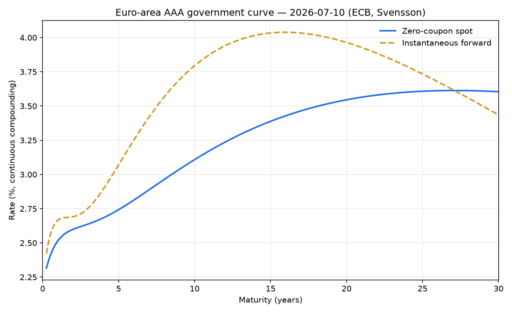
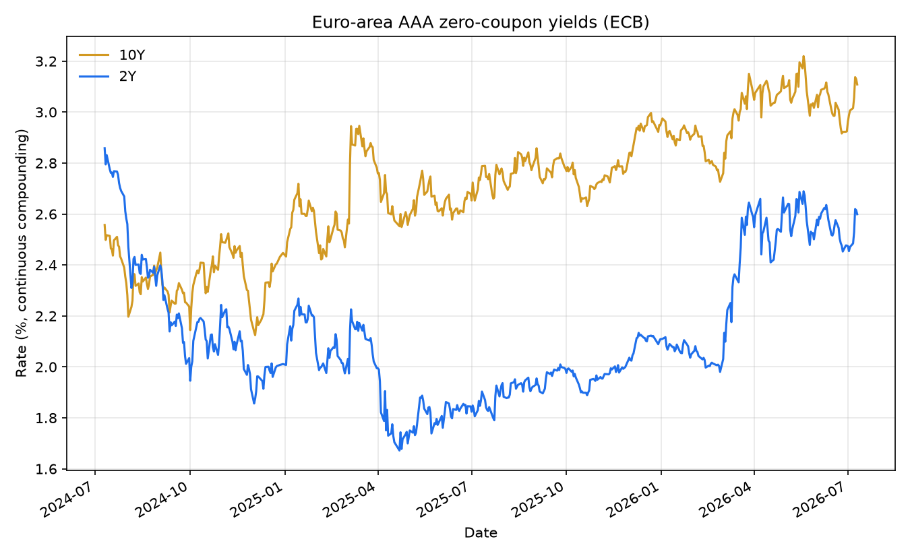

# eur-curves

**A living EUR yield-curve lab.** Every business day the ECB publishes the six Svensson
parameters of the euro-area AAA government bond curve. This repo fetches them, rebuilds the
full spot / forward / discount curve from the raw parameters, **proves the rebuild against the
ECB's own published spot rates** (must agree to 0.5 bp — in practice it agrees to ~1e-8 bp),
and commits a fresh snapshot + charts on a daily GitHub Actions cron.

Sibling of [svi-lab](https://github.com/0scarito/svi-lab) (volatility surfaces); this one is
the rates leg.

## The curve right now





Charts and [`data/latest.json`](data/latest.json) are refreshed by the
[`refresh` workflow](.github/workflows/refresh.yml) each weekday at 13:30 UTC.

## Validated against the source

The point of the exercise: if you evaluate the Svensson formula correctly, the ECB's published
zero-coupon spot rates fall out of the six parameters exactly. `scripts/refresh.py` checks this
on every run and refuses to write a snapshot if any tenor is off by more than 0.5 bp.

Actual output from the 2026-07-10 curve (run 2026-07-13):

```
 series  tenor  ECB published  our spot_rate   err (bp)
  SR_3M   0.25       2.315957       2.315957  -0.000000
  SR_6M   0.50       2.406181       2.406181  -0.000000
  SR_1Y   1.00       2.515208       2.515208  -0.000000
  SR_2Y   2.00       2.599299       2.599299   0.000000
  SR_5Y   5.00       2.743048       2.743048  -0.000000
  SR_7Y   7.00       2.887694       2.887694  -0.000000
 SR_10Y  10.00       3.108554       3.108554  -0.000000
 SR_15Y  15.00       3.388371       3.388371   0.000000
 SR_20Y  20.00       3.545609       3.545609  -0.000000
 SR_30Y  30.00       3.604663       3.604663  -0.000000

max |error|: 0.000000 bp (tolerance 0.5 bp)
```

Max absolute error on that run: **9.2e-9 bp** across all ten published tenors — pure
rounding noise, since the ECB publishes values to 10 decimal places.

## What it does

- **`eur_curves.svensson`** — the Svensson (1994) model: zero-coupon spot rate, continuous-compounding
  discount factor, and instantaneous forward rate, with analytic `t -> 0` limits.
  Scalar or NumPy-array maturities.
- **`eur_curves.ecb`** — client for the [ECB Data Portal](https://data.ecb.europa.eu/)
  (dataset `YC`, no API key needed): daily parameters, published spot rates, and their histories,
  parsed into a `CurveParams` dataclass / pandas frames.
- **`eur_curves.plots`** — the two charts above.
- **`scripts/refresh.py`** — fetch, validate, snapshot (`data/latest.json`), chart. Run by cron.

## Install

```bash
git clone https://github.com/0scarito/eur-curves
cd eur-curves
pip install -e ".[dev]"
```

Requires Python >= 3.10. Runtime deps: numpy, pandas, requests, matplotlib.

## Usage

```python
import eur_curves as ec

params = ec.fetch_params()            # latest ECB Svensson parameters
print(params.date, params.beta0)      # e.g. 2026-07-10 1.3035816676

y10 = ec.spot_rate(10.0, *params.as_tuple())     # 10Y zero rate, % cont. comp.
f10 = ec.forward_rate(10.0, *params.as_tuple())  # instantaneous forward at 10Y
p10 = ec.discount_factor(10.0, *params.as_tuple())

date, spots = ec.fetch_published_spots()         # the ECB's own numbers
assert abs(y10 - spots["SR_10Y"]) * 100 < 0.5    # basis points

hist = ec.fetch_spot_history(["SR_2Y", "SR_10Y"], start="2024-07-01")
```

Refresh the snapshot and charts locally:

```bash
python scripts/refresh.py
```

Tests are network-free by default (fixtures are verbatim captured ECB responses);
the live end-to-end check is opt-in:

```bash
pytest -q                        # 20 passed, 1 skipped
RUN_NETWORK_TESTS=1 pytest -m network
```

## How it works

The ECB fits a Svensson (extended Nelson-Siegel) curve to AAA-rated euro-area central
government bonds each TARGET business day and publishes the parameters
(beta0, beta1, beta2, beta3, tau1, tau2). The zero-coupon spot rate at maturity `t` years,
in percent with continuous compounding, is

```
y(t) = b0 + b1 * (1 - exp(-t/tau1)) / (t/tau1)
          + b2 * [(1 - exp(-t/tau1)) / (t/tau1) - exp(-t/tau1)]
          + b3 * [(1 - exp(-t/tau2)) / (t/tau2) - exp(-t/tau2)]
```

with `y(0) = b0 + b1`. The instantaneous forward rate is the derivative of `t * y(t)`:

```
f(t) = b0 + b1*exp(-t/tau1) + b2*(t/tau1)*exp(-t/tau1) + b3*(t/tau2)*exp(-t/tau2)
```

and the discount factor is `P(t) = exp(-y(t)/100 * t)`. `b0` is the long-run rate level,
`b0 + b1` the short-end anchor, and the `b2`/`b3` terms add two humps located
around `tau1` and `tau2`.

Data comes from the ECB Data Portal REST API,
`https://data-api.ecb.europa.eu/service/data/YC/B.U2.EUR.4F.G_N_A.SV_C_YM.<SERIES>?format=csvdata`,
where `<SERIES>` is `BETA0..TAU2` for parameters or `SR_3M..SR_30Y` for published spots.

Unit tests pin the implementation to reference values computed independently with 50-digit
`decimal` arithmetic (agreement checked at `rel=1e-13`), verify `f(t)` against a numerical
derivative of `t*y(t)`, and round-trip the discount factor.

## Limitations (read before using)

- **This is the AAA euro-area government curve, not a discounting curve.** Post-2008 practice
  discounts collateralised trades off OIS (€STR) curves; the ECB AAA curve is a *reference*
  government curve (a changing composition of AAA sovereigns — in practice dominated by
  Germany and a few others). Do not price swaps off it.
- **The Svensson fit is the ECB's, not ours.** We only re-evaluate their published parameters;
  we do not fit bonds ourselves, so we inherit whatever bond-selection and fitting choices the
  ECB made (yield-error minimisation, their filter rules).
- Parametric Nelson-Siegel-Svensson curves are smooth by construction — they cannot show
  cheap/rich micro-structure of individual bonds, and the short end (< 3M) is an extrapolation
  of the model, not an observed rate.
- Rates are **percent with continuous compounding** — convert before comparing with
  annually-compounded or par quotes.
- History plots use the published `SR_*` series (spot rates), not re-evaluated parameters.
- The ECB publishes around 12:00 CET on TARGET business days; on TARGET holidays that are
  weekdays the cron finds no new data and simply commits nothing.

## References

- Svensson, L.E.O. (1994), *Estimating and Interpreting Forward Interest Rates: Sweden 1992-1994*,
  NBER Working Paper No. 4871.
- Nelson, C.R. and Siegel, A.F. (1987), *Parsimonious Modeling of Yield Curves*,
  Journal of Business 60(4), 473-489.
- ECB, *Euro area yield curves — Technical notes*,
  https://www.ecb.europa.eu/stats/financial_markets_and_interest_rates/euro_area_yield_curves/html/index.en.html
- ECB Data Portal API, https://data.ecb.europa.eu/help/api/data

## License

MIT — see [LICENSE](LICENSE).
